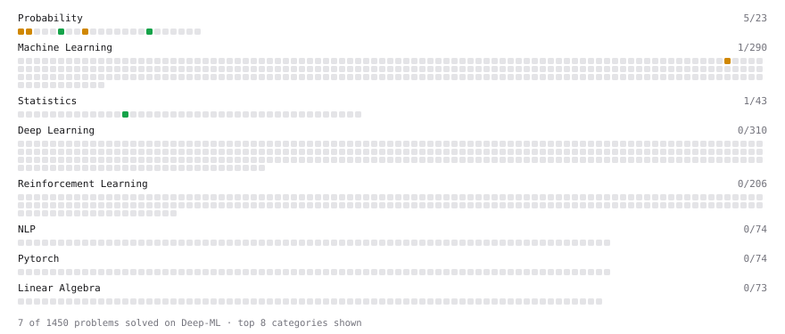

# Deep-ML

My machine learning practice from [Deep-ML](https://www.deep-ml.com). Every solution here was written by hand.

**6** solved · 2 problems · 0 labs · 4 math

[**Browse the interactive portfolio**](https://satyasettiveerapraveen17.github.io/deep-ml/) to replay this filling in over time.

## Problems

| | Difficulty | Solved | |
| --- | --- | --- | --- |
| [Calculate Conditional Probability from Data](https://www.deep-ml.com/problems/168) | easy | 2026-09-24 | [solution](problems/0168-calculate-conditional-probability-from-data) |
| [Numerical Gradient Checking](https://www.deep-ml.com/problems/313) | medium | 2026-09-21 | [solution](problems/0313-numerical-gradient-checking) |

## Math

| | Difficulty | Solved | |
| --- | --- | --- | --- |
| [Common Distributions I: Bernoulli, Binomial, Uniform](https://www.deep-ml.com/math-problems/21) | medium | 2026-09-21 | [solution](math/0021-common-distributions-i-bernoulli-binomial-uniform) |
| [Common Distributions II: Normal, Poisson, Exponential](https://www.deep-ml.com/math-problems/22) | medium | 2026-09-21 | [solution](math/0022-common-distributions-ii-normal-poisson-exponential) |
| [Law of Large Numbers and Central Limit Theorem](https://www.deep-ml.com/math-problems/23) | medium | 2026-09-24 | [solution](math/0023-law-of-large-numbers-and-central-limit-theorem) |
| [Multivariate Gaussians](https://www.deep-ml.com/math-problems/36) | medium | 2026-09-24 | [solution](math/0036-multivariate-gaussians) |

---

_This file is regenerated by Deep-ML on every push._
