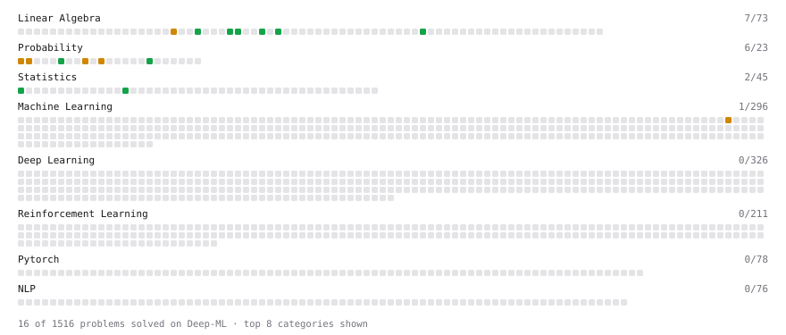

# Deep-ML

My machine learning practice from [Deep-ML](https://www.deep-ml.com). Every solution here was written by hand.

**31** solved · 22 problems · 0 labs · 9 math

[**Browse the interactive portfolio**](https://satyasettiveerapraveen17.github.io/deep-ml/) to replay this filling in over time.

## Problems

| | Difficulty | Solved | |
| --- | --- | --- | --- |
| [Calculate Conditional Probability from Data](https://www.deep-ml.com/problems/168) | easy | 2026-09-24 | [solution](problems/0168-calculate-conditional-probability-from-data) |
| [Calculate Cosine Similarity Between Vectors](https://www.deep-ml.com/problems/76) | easy | 2026-09-26 | [solution](problems/0076-calculate-cosine-similarity-between-vectors) |
| [Calculate Covariance Matrix](https://www.deep-ml.com/problems/10) | easy | 2026-10-02 | [solution](problems/0010-calculate-covariance-matrix) |
| [Compute Posterior Probability using Bayes' Theorem](https://www.deep-ml.com/problems/336) | easy | 2026-09-25 | [solution](problems/0336-compute-posterior-probability-using-bayes-theorem) |
| [Compute the Cross Product of Two 3D Vectors](https://www.deep-ml.com/problems/118) | easy | 2026-09-25 | [solution](problems/0118-compute-the-cross-product-of-two-3d-vectors) |
| [Demonstrate Law of Large Numbers with Sampling](https://www.deep-ml.com/problems/342) | easy | 2026-09-25 | [solution](problems/0342-demonstrate-law-of-large-numbers-with-sampling) |
| [Dot Product Calculator](https://www.deep-ml.com/problems/83) | easy | 2026-09-25 | [solution](problems/0083-dot-product-calculator) |
| [Implement Orthogonal Projection of a Vector onto a Line](https://www.deep-ml.com/problems/66) | easy | 2026-10-02 | [solution](problems/0066-implement-orthogonal-projection-of-a-vector-onto-a-line) |
| [L2 Normalization Along an Axis](https://www.deep-ml.com/problems/1022) | easy | 2026-09-26 | [solution](problems/1022-l2-normalization-along-an-axis) |
| [Vector Element-wise Sum](https://www.deep-ml.com/problems/121) | easy | 2026-09-25 | [solution](problems/0121-vector-element-wise-sum) |
| [Binomial Distribution Probability](https://www.deep-ml.com/problems/79) | medium | 2026-09-25 | [solution](problems/0079-binomial-distribution-probability) |
| [Calculate Correlation Matrix](https://www.deep-ml.com/problems/37) | medium | 2026-10-02 | [solution](problems/0037-calculate-correlation-matrix) |
| [Calculate Eigenvalues of a Matrix](https://www.deep-ml.com/problems/6) | medium | 2026-10-05 | [solution](problems/0006-calculate-eigenvalues-of-a-matrix) |
| [Central Limit Theorem Simulation](https://www.deep-ml.com/problems/182) | medium | 2026-09-26 | [solution](problems/0182-central-limit-theorem-simulation) |
| [Check if Matrix is Positive Definite](https://www.deep-ml.com/problems/332) | medium | 2026-10-05 | [solution](problems/0332-check-if-matrix-is-positive-definite) |
| [Conditional Probability from Joint Distribution](https://www.deep-ml.com/problems/180) | medium | 2026-09-24 | [solution](problems/0180-conditional-probability-from-joint-distribution) |
| [Gaussian Elimination for Solving Linear Systems](https://www.deep-ml.com/problems/58) | medium | 2026-10-02 | [solution](problems/0058-gaussian-elimination-for-solving-linear-systems) |
| [LU Decomposition of a Square Matrix](https://www.deep-ml.com/problems/333) | medium | 2026-10-06 | [solution](problems/0333-lu-decomposition-of-a-square-matrix) |
| [Normal Distribution PDF Calculator](https://www.deep-ml.com/problems/80) | medium | 2026-09-25 | [solution](problems/0080-normal-distribution-pdf-calculator) |
| [Numerical Gradient Checking](https://www.deep-ml.com/problems/313) | medium | 2026-09-21 | [solution](problems/0313-numerical-gradient-checking) |
| [QR Decomposition](https://www.deep-ml.com/problems/201) | hard | 2026-10-06 | [solution](problems/0201-qr-decomposition) |
| [Singular Value Decomposition (SVD) of 2x2 Matrix](https://www.deep-ml.com/problems/12) | hard | 2026-10-05 | [solution](problems/0012-singular-value-decomposition-svd-of-2x2-matrix) |

## Math

| | Difficulty | Solved | |
| --- | --- | --- | --- |
| [Common Distributions I: Bernoulli, Binomial, Uniform](https://www.deep-ml.com/math-problems/21) | medium | 2026-09-21 | [solution](math/0021-common-distributions-i-bernoulli-binomial-uniform) |
| [Common Distributions II: Normal, Poisson, Exponential](https://www.deep-ml.com/math-problems/22) | medium | 2026-09-21 | [solution](math/0022-common-distributions-ii-normal-poisson-exponential) |
| [Law of Large Numbers and Central Limit Theorem](https://www.deep-ml.com/math-problems/23) | medium | 2026-09-24 | [solution](math/0023-law-of-large-numbers-and-central-limit-theorem) |
| [Multivariate Gaussians](https://www.deep-ml.com/math-problems/36) | medium | 2026-09-24 | [solution](math/0036-multivariate-gaussians) |
| [Optimization: Convexity and Critical Points](https://www.deep-ml.com/math-problems/6) | medium | 2026-09-30 | [solution](math/0006-optimization-convexity-and-critical-points) |
| [Regularization and Generalization](https://www.deep-ml.com/math-problems/31) | medium | 2026-10-05 | [solution](math/0031-regularization-and-generalization) |
| [Taylor Expansions and Local Quadratic Models](https://www.deep-ml.com/math-problems/37) | medium | 2026-09-29 | [solution](math/0037-taylor-expansions-and-local-quadratic-models) |
| [Eigendecomposition and SVD](https://www.deep-ml.com/math-problems/16) | hard | 2026-09-30 | [solution](math/0016-eigendecomposition-and-svd) |
| [Matrix Decompositions: LU and QR](https://www.deep-ml.com/math-problems/15) | hard | 2026-10-01 | [solution](math/0015-matrix-decompositions-lu-and-qr) |

---

_This file is regenerated by Deep-ML on every push._
